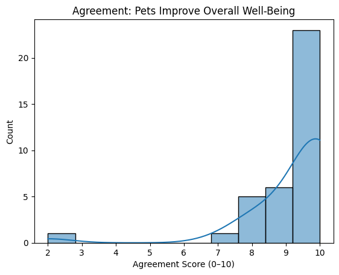
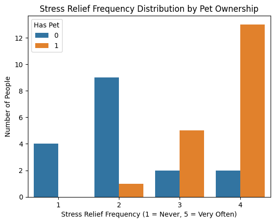
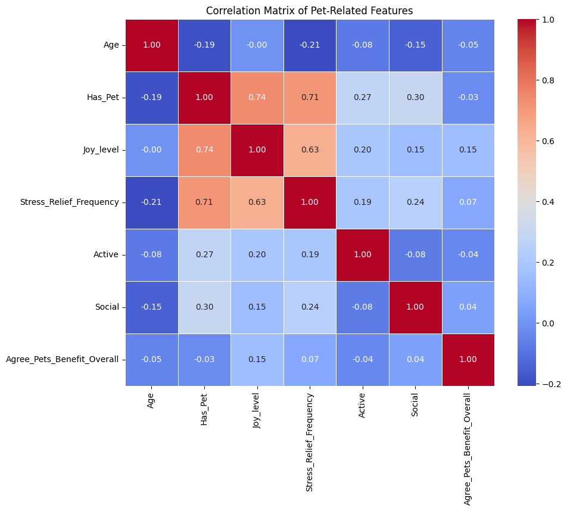

# pet-ownership-effect-data-science-project
Analyzing the impact of pet ownership on stress relief, joy, and social well-being using data science and statistical testing.

This project investigates how owning pets influences stress relief, joy, social engagement, and overall well-being using statistical analysis and visual exploration.

---

## 📊 Project Summary

We conducted a survey among university students to explore how pet ownership affects lifestyle and emotional well-being. The data was processed, cleaned, and analyzed using Python, with a focus on:

- Exploratory Data Analysis (EDA)
- Hypothesis Testing
- Statistical Correlation

---

## 📁 Files

- `pet_ownership_statistical_analysis.ipynb`: Jupyter/Colab notebook with full analysis
- `pet_ownership_statistical_analysis_report.docx`: Project report with methodology and results
- `dataset.xlsx`: Collected survey data 

---

## 🧠 Methods Used

- **Data Cleaning & Encoding**
- **Visualization**: Histogram, count plots, heatmaps
- **Statistical Testing**:
  - T-test for stress relief
  - Chi-square for social impact and joy
  - Spearman correlation for activity levels

---

## 🔍 Key Findings

| Hypothesis                          | Test Used    | Result       | Conclusion                      |
|------------------------------------|--------------|--------------|---------------------------------|
| Pets help reduce stress            | T-Test       | p < 0.001    | ✅ Significant effect            |
| Pets increase social engagement    | Chi-Square   | p = 0.006    | ✅ Significant effect            |
| Pets improve joy levels            | Chi-Square   | p < 0.001    | ✅ Strong positive correlation   |
| Pets make people more active       | Spearman     | p = 0.106    | ❌ Not statistically significant |

---

## 📈 Visual Highlights


*Most participants strongly agreed that pets improve overall well-being.*


*Pet owners reported stress relief more frequently than non-owners.*


*Heatmap showing relationships between pet-related factors.*

---

## 🚀 How to Run

1. Clone the repo:
   ```bash
   git clone https://github.com/naomi-afrin/pet-ownership-effect-data-science-project.git
   cd pet-ownership-effect-data-science-project

## 📬 Contact

If you have any questions or are interested in collaboration, feel free to reach out:  
📧 naomiafrin12@gmail.com  
🔗 [LinkedIn](https://www.linkedin.com/in/naomi-jalil-240160227/)
